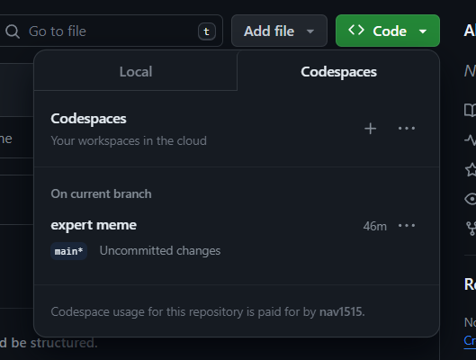
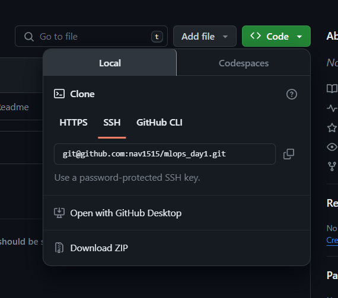

# mlops_day1
###### The goal of this Github Repo is to show how a Good ML Project should be structured.

## Agenda
### Training Pipeline
Transforming a Jupyter Notebook into a training job.
- Turning the Notebook into an executable python file.
- Best Practices to follow: Folder Structure, Documentation, Logging, Testing and Modularization.

## Problem Statement
Predict the Duration for a Taxi Trip
- Dataset link:
[NYC Taxi](https://www.nyc.gov/site/tlc/about/tlc-trip-record-data.page)
- The Goal is to predict the time taken to travel from Point A to Point B
- The [Notebook](https://github.com/alexeygrigorev/ml-engineering-contsructor-workshop/blob/main/01-train/duration-prediction-starter.ipynb) used is from [Alexey Grigorev](https://github.com/alexeygrigorev) who is an excellent Data Science Instructor and his repository has a good collection for Machine Learning

## Environment Setup
### Overview:
- Github Codespaces or Working Locally
- Installing the required packages using pipenv
- Alternative Setups
--- 
### Creating a Github Repo
Create a Repo and name anything say mlops

### Either work locally or work on codespace
Codespace is like VSCode but instead of working on your local machine you will be working on the Cloud hosted through Github, See the snapshot below for more info:

Of course you can work locally by copying the ssh url, as shown below in the Image and then running git clone <your ssh url here>

